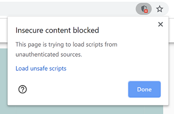
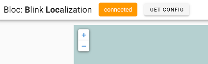
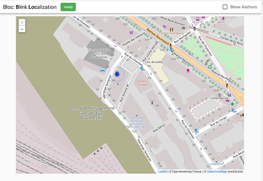

# bloc / Blink Localization

`bloc` shows latest positions of tags on map.

## How it works

`bloc` communicates with a localization `manager` via MQTT. `manager`
is supposed to publish deployment configuration and positions of
tags. Actual commands and message formats passed over MQTT can be
found in [./demo/manager.py](./demo/manager.py).

You can build a complete solution implementing a localization
algorithm and MQTT communication part on top of [Blink
project](https://github.com/yatch/smartmeshsdk/tree/blink/app/Blink).

## Configuration

MQTT configuration parameters are set in
[src/config.js](./src/config.js); update the file for your settings.

## Demo

Access https://yatch.github.io/bloc, which is auto-generated by Travis
CI. You may have a pop-up like this:

<p align="center">
   
</p>

This is because your browser is trying to connect a MQTT broker using
`ws` scheme, which is not cryptographyically protected, while you're
accessing the demo page via HTTPS.
To make the demo work properly, you need to "Load unsafe scripts." at
your own risk.

If you can see "GET CONFIG" button on top, there may be no `manager`
running which provides locations of tags.

<p align="center">
   
</p>

You can run a `manager` process on your own:

```
$ pip install -r requirements.txt
$ demo/manager.py
connected
subscribe to bloc/demo
```

Then, push "GET CONFIG" button to fetch configuration data from the
`manager`. If everything works fine, your browser should show a map of
somewhere.

<p align="center">
   
</p>

If `bloc` says it's disconnected, retry by reloading the page.

## How to build
Install [Node.js](https://nodejs.org/en/); then

```
$ npm install
$ npm run build
```

For development, the following command is super powerful:

```
$ npm run serve
```

Access http://127.0.0.1:8080/ in your web brower.
